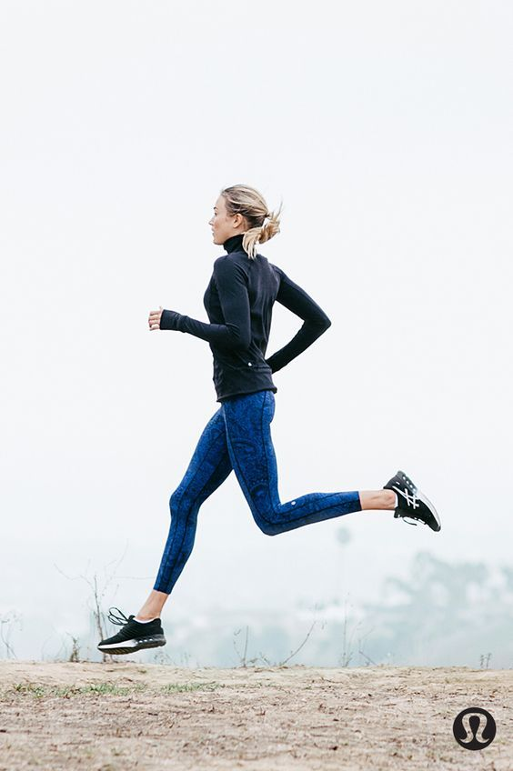
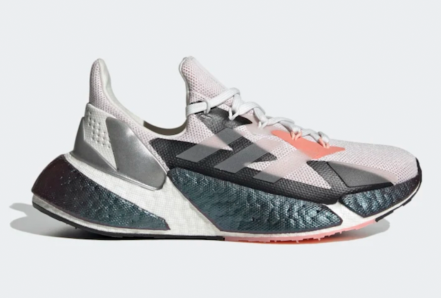

# Why you should start running
<html>
<head>
Exercise is important for both physical and mental health. If you're looking to way to start, running is an easy, affordable way to get your exercise without going to the gym.
  </head>
<body>
  <h1>How to start</h1>

To start running, all you need is a pair of good sneakers and some aethleisure. There is no special equitment or previous experience needed, and you don't need to worry about going to a gym as long as you live in a neighborhood with sidewalks!

   <!--picture of someone running-->
  <h2>Shoes</h2>
  
 While running shoes can be expensive, they last for a long time and are a good investment. It's important to use shoes that support your feet and ankles, sneakers with little support--like vans or converse--are not ideal. If you run with these types of shoes, you run the risk of getting injured, and your experience will be less enjoyable.
  Brands such as Nike and Adidas have great options in various different styles, such as the ones shown below. 

  <h3>Nike Air Zoom Pegasus</h3>
  
  <h3>Womans Adidas X9000L4</h3>
      
  <h2>Aethleisure</h2>

Wearing the right clothes while running is important to give your body enough flexability to move, and enough room to breathe and prevent sweating. Brands like Lululemon, Set Active, and Nike have cute, comfortable, high quality pieces that will last. 
 
</head>
</html>
